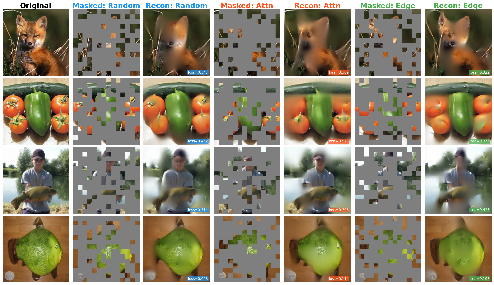
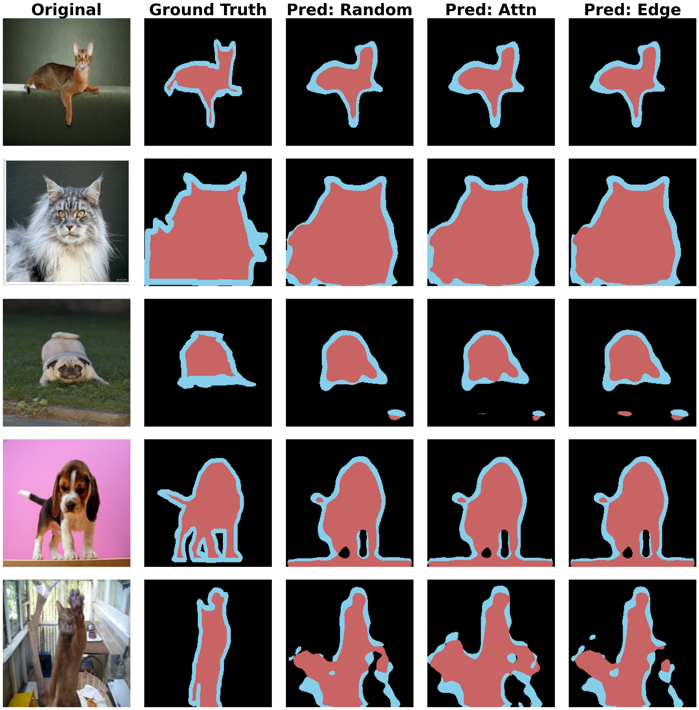

<div align="right">
  <a href="#english-version">English</a> | <a href="#chinese-version">中文</a>
</div>

---

<div align="center">

# Masked Autoencoders: Reproduction & Extension

<a href="#english-version">
  
</a>
<a href="#chinese-version">
  
</a>


</div>

---

<h2 id="english-version">🇬🇧 English Version</h2>

<div align="center">

### Reproduction and Extension of Masked Autoencoders for Vision Learning
**Based on He et al., "Masked Autoencoders Are Scalable Vision Learners", CVPR 2022**

</div>

## Table of Contents

- [Overview](#overview)
- [Architecture](#architecture)
- [Extensions](#extensions)
- [Results](#results)
- [Visualizations](#visualizations)
- [Project Structure](#project-structure)
- [Installation](#installation)
- [Usage](#usage)
- [Compute Constraints](#compute-constraints)
- [References](#references)

---

## Overview

This project provides a **from-scratch PyTorch implementation** of the Masked Autoencoder (MAE) framework, without relying on high-level APIs from `timm` or `transformers`. Building upon the core reproduction, we extend the work along two dimensions:

- **Direction A**: Two novel content-aware masking strategies — *Edge-Guided* and *Attention-Guided* masking — explored as alternatives to the original random masking paradigm.
- **Direction B**: Transfer of the pre-trained MAE encoder to the **Oxford-IIIT Pet** dataset for both image classification and semantic segmentation fine-tuning.

The project systematically evaluates the impact of masking strategies on downstream task performance, providing both quantitative benchmarks and qualitative visualizations.

---

## Architecture

### ViT Backbone (`my_vit.py`)

Implemented entirely with PyTorch primitives and `einops`:

- **Patch Embedding**: `einops.Rearrange` for `[N,C,H,W] → [N,L,D]` without explicit convolution
- **Transformer Block** (`MyBlock`): Pre-LayerNorm → `nn.MultiheadAttention` → Residual → Pre-LayerNorm → MLP (GELU) → Residual
- **Weight Initialization**: Xavier uniform for Linear/MHA projections; constant for LayerNorm; truncated normal (std=0.02) for learnable parameters
- **Pooling**: Configurable CLS-token or global mean pooling for downstream tasks

### MAE Core (`my_mae.py`)

Follows the asymmetric encoder–decoder design from He et al.:

```
Input Image [B,3,224,224]
     ↓  PatchEmbed (einops Rearrange + Linear)
Patch Tokens [B, 196, 768]
     ↓  + Positional Encoding (fixed 2D sinusoidal)
     ↓  Masking Strategy (random / edge / attn)
Visible Tokens [B, 49, 768]  ← only 25% patches
     ↓  + CLS Token → Encoder (16× MyBlock)
Encoded Features [B, 50, 768]
     ↓  Linear Projection (enc_dim → dec_dim)
     ↓  Insert mask tokens + Restore order (ids_restore)
Full Sequence [B, 197, 512]
     ↓  + Decoder Positional Encoding → Decoder (6× MyBlock)
     ↓  Linear Head → Pixel Prediction
Reconstructed Patches [B, 196, 768]
     ↓  MSE Loss (on masked patches only)
```

**Key implementation details:**
- `ids_shuffle / ids_keep / ids_restore` triple-index mechanism for lossless mask-unshuffle
- Fixed sinusoidal positional encoding via `util.pos_embed.get_2d_sincos_pos_embed`
- CLS token positional encoding set to zero vector (positional placeholder only)
- Loss computed exclusively on masked patches: `(loss * mask).sum() / mask.sum()`

---

## Extensions

### Direction A — Content-Aware Masking Strategies

The original MAE evaluates random, block, and grid masking — all geometrically-driven and content-agnostic. We investigate two semantically-informed strategies:

#### Edge-Guided Masking (`edge_guided_masking`)

Motivated by the observation that edges and object boundaries carry disproportionate structural information:

1. Convert input image to grayscale and apply **Sobel filters** (x and y directions)
2. Compute per-patch average edge magnitude via average pooling
3. Mix edge scores with uniform random noise via convex combination:

$$
\text{score} = (1-\alpha) \cdot \text{random} + \alpha \cdot score_{\text{edge}}
$$

4. Sort ascending → keep lowest-scoring patches (background-biased visible set) → mask high-edge patches

**Hyperparameter**: α=0.2 (tuned from initial α=0.5; higher α caused training instability due to spatial clustering of masked regions)

#### Attention-Guided Masking (`attn_guided_masking`)

Leverages the model's own attention to identify semantically salient regions:

1. Prepend CLS token + positional encoding to patch embeddings
2. Pass through **first Transformer Block only** (lightweight; `torch.no_grad()`)
3. Extract CLS→patch attention weights: `attn_weights[:, 0, 1:]` → `[B, L]`
4. Min-Max normalize; mix with random noise:

$$
\text{score} = (1-\alpha) \cdot \text{random} + \alpha \cdot score_{\text{attn}}
$$

5. Sort ascending → keep low-attention patches → mask high-attention patches

**Hyperparameter**: α=0.3

Both strategies encode the same philosophy: **mask semantically informative regions to create a harder reconstruction task**, analogous to hard example mining in supervised learning.

#### Theoretical Analysis

During development, we observed that content-aware masking introduces a structural tension in MAE's asymmetric architecture:

| | Mask Hard (our impl.) | Keep Hard Visible |
|---|---|---|
| Encoder Input | Biased to easy patches | Biased to hard patches |
| Decoder Task | Over-hard | Too easy |
| Gradient Signal | Distribution-biased | Insufficient |

Random masking statistically guarantees both encoder input diversity and balanced decoder reconstruction difficulty — properties that content-aware masking disrupts. This finding is reflected in our experimental results.

### Direction B — Downstream Fine-tuning

**Linear Probing** (`main_linprobe.py`): Encoder frozen; only a linear classification head trained. Tests raw feature linear separability.

**Classification Fine-tuning** (`main_finetune.py`): Full encoder unfrozen with Layer-wise Learning Rate Decay (LLRD, `layer_decay=0.75`). Data augmentation: Mixup (α=0.2) + CutMix (α=0.1).

**Semantic Segmentation Fine-tuning** (`main_segmentation.py`): Encoder patch tokens reshaped to spatial feature maps → simple convolutional decoder → per-pixel 3-class prediction (foreground / background / boundary). Evaluated with mIoU and Global Accuracy.

---

## Results

### Pre-training (ImageNet-Mini, 500 Epochs)

| Strategy | mask_ratio | Best Loss | Final Loss | Pre-train Time |
|----------|-----------|-----------|------------|----------------|
| **Random** | 0.75 | **0.293** | 0.294 | ~24h |
| Attn-Guided | 0.75 | 0.328 | 0.345 | ~24h |
| Edge-Guided | 0.75 | 0.335 | 0.335 | ~24h |

### ImageNet-Mini Downstream (Random Model Only)

| Evaluation | Epochs | Acc@1 | Acc@5 | Note |
|------------|--------|-------|-------|------|
| Linear Probe | 90 | 8.11% | 20.42% | Encoder frozen; 769K trainable params |
| Full Fine-tune | 90 | **36.55%** | 59.44% | +28.4pp over linear probe |

### Oxford-IIIT Pet Classification (50 Epochs)

| Pre-train Strategy | Acc@1 | Acc@5 | Best Loss |
|-------------------|-------|-------|-----------|
| **Random** | **78.63%** | **96.57%** | 0.828 |
| Edge-Guided | 76.42% | 96.48% | 0.861 |
| Attn-Guided | 76.32% | 95.64% | 0.889 |

### Oxford-IIIT Pet Segmentation (50 Epochs, 3-class)

| Pre-train Strategy | mIoU | Global Acc | Best Loss |
|-------------------|------|------------|----------|
| Attn-Guided | **59.65%** | 81.75% | 0.514 |
| Edge-Guided | 59.63% | **81.79%** | **0.514** |
| **Random** | 59.56% | 81.77% | 0.515 |

**Key Observation**: The strategy ranking inverts between classification (~2.3pp gap) and segmentation (<0.1pp gap), suggesting content-aware masking may have marginal benefits for local feature learning in dense prediction tasks, though the difference is within measurement noise.

---

## Visualizations

### Masked Image Reconstruction

Three-strategy comparison on held-out images. Each row shows the same image reconstructed by all three pre-trained models after 500 epochs.

*Column order: Original | Masked:Random | Recon:Random | Masked:Attn | Recon:Attn | Masked:Edge | Recon:Edge*



> The reconstruction grid demonstrates that all three strategies learn coherent image structure. Random masking produces the lowest reconstruction loss, consistent with its statistically balanced masking distribution. Content-aware strategies show higher loss due to systematically harder masking configurations.

### Semantic Segmentation

Five representative samples spanning easy → hard difficulty levels, compared across all three pre-trained models.

*Column order: Original | Ground Truth | Pred:Random | Pred:Attn | Pred:Edge*



> Qualitative results confirm the quantitative finding: the three strategies produce visually indistinguishable segmentation masks, consistent with the <0.1pp mIoU difference. All models successfully capture the primary foreground object while struggling with complex backgrounds and fine limb structures — a shared limitation attributable to the patch-level (16×16) resolution of the ViT backbone.

---

## Project Structure

```
MAE_Reproduction_Extension/
│
├── my_vit.py                    # ViT backbone: MyBlock + MyVit
├── my_mae.py                    # MAE: 3 masking strategies + forward/loss
├── models_seg.py                # Segmentation model head
│
├── main_pretrain.py             # Pre-training entry point
├── main_finetune.py             # Classification fine-tuning
├── main_linprobe.py             # Linear probing evaluation
├── main_segmentation.py         # Segmentation fine-tuning
│
├── engine_pretrain.py           # Pre-training loop
├── engine_finetune.py           # Fine-tuning loop (from MAE official)
├── engine_segmentation.py       # Segmentation training loop
│
├── my_util/
│   ├── edge_ops.py              # SobelPatchScorer for edge-guided masking
│   └── datasets_seg.py          # Dataset loading for segmentation tasks
│
├── util/                        # From MAE official repo
│   ├── crop.py
│   ├── datasets.py
│   ├── lars.py
│   ├── pos_embed.py             # 2D sinusoidal positional encoding
│   ├── misc.py                  # Distributed utils, checkpoint I/O
│   ├── lr_sched.py              # Cosine LR schedule with warmup
│   └── lr_decay.py              # Layer-wise LR decay (LLRD)
│
├── artifacts/                   # docs, experiment records, visualizations
│
├── demo-reconstruction.ipynb    # Multi-model reconstruction visualization
├── demo-segmentation.ipynb      # Segmentation result visualization
└── test_model.py                # Sanity check for model forward pass
```

**Implemented from scratch** (no timm model APIs):
`my_vit.py`, `my_mae.py`, `my_util/edge_ops.py`, `models_seg.py`, masking logic in `my_mae.py`

**Adapted from MAE official repository** (with modifications):
`main_pretrain.py` (argument parser, checkpoint management), `engine_pretrain.py`, `util/`

---

## Installation

```bash
# Clone the repository
git clone https://github.com/your-username/MAE_Reproduction_Extension.git
cd MAE_Reproduction_Extension

# Install dependencies
pip install torch torchvision timm einops matplotlib pillow requests
```

**Environment**: Python 3.9+, PyTorch 2.x, CUDA 11.8+

---

## Usage

### Pre-training

```bash
PYTHONPATH=. torchrun --nproc_per_node=2 main_pretrain.py \
    --data_path /path/to/imagenet-mini/train \
    --output_dir ./output/pretrain \
    --log_dir ./output/pretrain \
    --mask_type random \
    --mask_ratio 0.75 \
    --epochs 500 \
    --warmup_epochs 5 \
    --blr 1.5e-4 \
    --batch_size 32 \
    --accum_iter 4
```

### Resume Pre-training

```bash
PYTHONPATH=. torchrun --nproc_per_node=2 main_pretrain.py \
    --resume /path/to/checkpoint-240.pth \
    --epochs 500
```

### Linear Probing

```bash
PYTHONPATH=. torchrun --nproc_per_node=2 main_linprobe.py \
    --model my_vit \
    --finetune /path/to/checkpoint-best.pth \
    --data_path /path/to/imagenet-mini \
    --nb_classes 1000 \
    --epochs 90 \
    --blr 0.1 \
    --weight_decay 0.0
```

### Classification Fine-tuning

```bash
PYTHONPATH=. torchrun --nproc_per_node=2 main_finetune.py \
    --model my_vit \
    --finetune /path/to/checkpoint-best.pth \
    --dataset pet \
    --data_path /path/to/dataset \
    --nb_classes 37 \
    --epochs 50 \
    --blr 1e-3 \
    --layer_decay 0.75 \
    --weight_decay 0.05 \
    --mixup 0.2 \
    --cutmix 0.1
```

### Segmentation Fine-tuning

```bash
PYTHONPATH=. torchrun --nproc_per_node=2 main_segmentation.py \
    --model my_vit \
    --finetune /path/to/checkpoint-best.pth \
    --dataset pet_seg \
    --data_path /path/to/oxford-iiit-pet \
    --nb_classes 3 \
    --epochs 50 \
    --blr 5e-4 \
    --layer_decay 0.75 \
    --weight_decay 0.05
```

---

## Compute Constraints

> ⚠️ **Note on Training Scale**
>
> All experiments are conducted under significant computational constraints compared to the original paper:
>
> | | This Project | Original MAE |
> |---|---|---|
> | Hardware | Kaggle T4×2 (2×16GB) | TPU-v3 / A100 cluster |
> | Dataset | ImageNet-Mini (~38.7K imgs) | ImageNet-1K (1.28M imgs) |
> | Pre-train Epochs | **500** | **800–1600** |
> | Effective Batch Size | 256 | 4096 |
> | ViT Size | ViT-Base (86M) | ViT-Large (307M) |
>
> The original paper reports ImageNet fine-tune Acc@1 of **83.1%** (ViT-Large, 1600 epochs). Our results (36.55% on ImageNet-Mini, 78.63% on Pet) are not directly comparable and should be interpreted as relative comparisons between masking strategies under controlled conditions.
>
> The pre-training loss values (~0.29–0.34) are higher than the original paper (~0.15–0.20) due to reduced data diversity and shorter training, which is expected and acceptable within the scope of this reproduction study.

---

## References

```bibtex
@inproceedings{he2022masked,
  title={Masked Autoencoders Are Scalable Vision Learners},
  author={He, Kaiming and Chen, Xinlei and Xie, Saining and Li, Yanghao
          and Doll{\'a}r, Piotr and Girshick, Ross},
  booktitle={CVPR},
  year={2022}
}

@inproceedings{dosovitskiy2021image,
  title={An Image is Worth 16x16 Words: Transformers for Image Recognition at Scale},
  author={Dosovitskiy, Alexey and others},
  booktitle={ICLR},
  year={2021}
}
```

### Reference Repositories

- **Official MAE Implementation**: [facebookresearch/mae](https://github.com/facebookresearch/mae)
  — Training pipeline (`engine_pretrain.py`), utility functions (`util/`), and argument parser structure are adapted from this repository.

- **Community ViT Implementation**: [lucidrains/vit-pytorch](https://github.com/lucidrains/vit-pytorch)
  — Referenced for clean einops-based patch embedding patterns.

---

<br>

---

<h2 id="chinese-version">🇨🇳 中文版本</h2>

<div align="center">

### 掩码自编码器视觉预训练复现与扩展
**基于 He et al., "Masked Autoencoders Are Scalable Vision Learners", CVPR 2022**

</div>

<a id="目录"></a>

## 目录

- [项目概述](#项目概述)
- [模型架构](#模型架构)
- [扩展内容](#扩展内容)
- [实验结果](#实验结果)
- [可视化结果](#可视化结果)
- [项目结构](#项目结构)
- [环境安装](#环境安装)
- [使用方法](#使用方法)
- [算力说明](#算力说明)
- [参考资料](#参考资料)

---

<a id="项目概述"></a>

## 项目概述

本项目基于 PyTorch **从零实现**掩码自编码器（MAE）框架，不依赖 `timm` 或 `transformers` 的高层模型 API，在完成核心架构复现的基础上沿两个方向进行扩展：

- **扩展方向 A**：设计并实现边缘引导（Edge-Guided）和注意力引导（Attention-Guided）两种内容感知掩码策略，探索其相对于原论文随机掩码的优劣。
- **扩展方向 B**：将预训练 Encoder 迁移至 Oxford-IIIT Pet 数据集，完成图像分类与语义分割微调，系统评估预训练特征对密集预测任务的迁移能力。

---

<a id="模型架构"></a>

## 模型架构

### ViT Backbone（`my_vit.py`）

使用 PyTorch 基础模块与 `einops` 从零实现，不依赖 timm 的 `Block` / `PatchEmbed` API：

- **Patch 嵌入**：`einops.Rearrange` 将 `[N,C,H,W] → [N,L,D]`，无需显式卷积
- **Transformer Block**（`MyBlock`）：Pre-LayerNorm → `nn.MultiheadAttention` → 残差连接 → Pre-LayerNorm → MLP（GELU）→ 残差连接
- **权重初始化**：Linear/MHA 投影使用 Xavier Uniform；LayerNorm 使用常数初始化；可学习参数使用截断正态（std=0.02）
- **特征汇聚**：支持 CLS Token 和 Global Mean Pooling 两种模式，通过 `pool` 参数切换

### MAE 核心架构（`my_mae.py`）

对应原论文的非对称 Encoder-Decoder 设计：

```
输入图像 [B,3,224,224]
   ↓  PatchEmbed（einops Rearrange + Linear）
Patch Token [B, 196, 768]
   ↓  + 固定 2D 正余弦位置编码
   ↓  掩码策略（random / edge / attn）
可见块 [B, 49, 768]  ← 仅 25% 的 patch 进入 Encoder
   ↓  + CLS Token → Encoder（16 层 MyBlock）
编码特征 [B, 50, 768]
   ↓  线性降维（enc_dim → dec_dim）
   ↓  插入 mask token + ids_restore 还原顺序
完整序列 [B, 197, 512]
   ↓  + Decoder 位置编码 → Decoder（6 层 MyBlock）
   ↓  线性头 → 像素预测
重建 Patch [B, 196, 768]
   ↓  MSE Loss（仅在被掩码区域计算）
```

**关键实现细节：**
- `ids_shuffle / ids_keep / ids_restore` 三索引机制实现无损掩码-还原
- 固定正余弦位置编码通过 `util.pos_embed.get_2d_sincos_pos_embed` 生成
- CLS Token 的位置编码设为全零向量（仅作占位，在 MAE 中不传递位置语义）
- Loss 仅在被掩码的 patch 上计算：`(loss * mask).sum() / mask.sum()`

---

<a id="扩展内容"></a>

## 扩展内容

### 扩展方向 A — 内容感知掩码策略

原论文验证了随机掩码、块掩码和网格掩码三种策略，均属于内容无关的几何遮盖。本项目在此基础上探索两种基于语义信息的掩码机制：

#### 边缘引导掩码（`edge_guided_masking`）

动机：边缘和物体轮廓区域承载了图像中最密集的结构信息。

1. 将输入图像转换为灰度图，分别应用 **Sobel 水平/垂直滤波器**
2. 计算每个 patch 的平均边缘强度（Average Pooling）
3. 与均匀随机噪声进行凸组合：

$$
\text{score} = (1-\alpha) \cdot \text{random} + \alpha \cdot score_{\text{edge}}
$$

4. 升序排序 → 保留低分 patch（背景偏向）→ 掩盖高边缘强度 patch

**超参数**：α=0.2（从初始 α=0.5 调优；较高的 α 因掩码的空间聚集导致训练不稳定）

#### 注意力引导掩码（`attn_guided_masking`）

动机：利用模型自身的注意力机制识别语义显著区域。

1. 将 patch embedding 加上 CLS Token 和位置编码，送入**第一层 Transformer Block**（`torch.no_grad()` 下）
2. 提取 CLS→patch 的注意力权重：`attn_weights[:, 0, 1:]` → `[B, L]`
3. Min-Max 归一化后与随机噪声凸组合：

$$
\text{score} = (1-\alpha) \cdot \text{random} + \alpha \cdot score_{\text{attn}}
$$

4. 升序排序 → 保留低注意力 patch → 掩盖高显著性区域

**超参数**：α=0.3

#### 理论分析

在实验过程中，我们发现内容感知掩码在 MAE 非对称架构下面临结构性矛盾：

| | 掩盖高信息区域（本实现） | 保留高信息区域 |
|---|---|---|
| Encoder 输入 | 偏向 easy patch | 偏向 hard patch |
| Decoder 任务难度 | 过高 | 过低 |
| Encoder 梯度信号 | 输入分布偏斜 | 学习压力不足 |

Random masking 在统计意义上同时保证了 Encoder 输入分布的多样性和 Decoder 重建难度的均衡性。

### 扩展方向 B — 下游任务微调

**线性探测**（`main_linprobe.py`）：完全冻结 Encoder，仅训练线性分类头，测试特征的线性可分性。

**分类微调**（`main_finetune.py`）：解冻全部参数，使用分层学习率衰减（LLRD，`layer_decay=0.75`）+ Mixup（α=0.2）+ CutMix（α=0.1）。

**语义分割微调**（`main_segmentation.py`）：将 Encoder 输出的 patch token 重新排列为空间特征图，接简单卷积解码器进行逐像素 3 类预测（前景/背景/边界），以 mIoU 和 Global Accuracy 评估。

---

<a id="实验结果"></a>

## 实验结果

### 预训练阶段（ImageNet-Mini，500 Epoch）

| 策略 | mask_ratio | 最优 Loss | 最终 Loss | 预训练时长 |
|------|-----------|-----------|-----------|-------|
| **Random** | 0.75 | **0.293** | 0.294 | ~24h  |
| Attn-Guided | 0.75 | 0.328 | 0.345 | ~24h  |
| Edge-Guided | 0.75 | 0.335 | 0.335 | ~24h  |

### ImageNet-Mini 下游1000类分类评估（Random 模型）

| 评估方式 | Epoch | Acc@1 | Acc@5 | 说明 |
|----------|-------|-------|-------|------|
| Linear Probe | 90 | 8.11% | 20.42% | Encoder 冻结；769K 可训参数 |
| Full Fine-tune | 90 | **36.55%** | 59.44% | 较线性探测提升 +28.4pp |

### Oxford-IIIT Pet 分类（50 Epoch，37类）

| 预训练策略 | Acc@1 | Acc@5 | 最优 Loss |
|-----------|-------|-------|----------|
| **Random** | **78.63%** | **96.57%** | 0.828 |
| Edge-Guided | 76.42% | 96.48% | 0.861 |
| Attn-Guided | 76.32% | 95.64% | 0.889 |

### Oxford-IIIT Pet 语义分割（50 Epoch，3 类）

| 预训练策略 | mIoU | Global Acc | 最优 Loss |
|-----------|------|------------|----------|
| Attn-Guided | **59.65%** | 81.75% | 0.514 |
| Edge-Guided | 59.63% | **81.79%** | **0.514** |
| **Random** | 59.56% | 81.77% | 0.515 |

**发现**：分类任务上策略间差距约 2.3pp，而分割任务上差距收窄至 <0.1pp（评估噪声范围内）。这一对比提示内容感知掩码对局部特征学习可能存在潜在优势，但在当前训练规模下效果被掩盖，无法得出显著性结论。

---

<a id="可视化结果"></a>

## 可视化结果

### 掩码图像重建对比

三种掩码策略在同一张图上的重建效果对比（500 epoch 预训练权重）：

*列顺序：原图 | Masked:Random | Recon:Random | Masked:Attn | Recon:Attn | Masked:Edge | Recon:Edge*


> Random 掩码的重建 Loss 最低，符合其统计均衡的掩码分布特性。内容感知策略因系统性引入更难的掩码配置，重建 Loss 更高，但三种策略均表现出对图像基本结构和色彩的学习能力。

### 语义分割效果对比

*列顺序：原图 | Ground Truth | Pred:Random | Pred:Attn | Pred:Edge*


> 定性结果与量化结论高度一致：三种策略产生的分割掩码在视觉上几乎无法区分，进一步验证 mIoU 差距 <0.1pp 的数字意义。所有模型的共同局限在于对四肢细节和复杂背景的处理，这主要源于 ViT patch 分辨率（16×16）的固有限制，与掩码策略无关。

---

<a id="项目结构"></a>

## 项目结构

```
MAE_Reproduction_Extension/
│
├── my_vit.py                    # ViT Backbone：MyBlock + MyVit（从零实现）
├── my_mae.py                    # MAE：三种掩码策略 + forward/loss（从零实现）
├── models_seg.py                # 分割任务头
│
├── main_pretrain.py             # 预训练入口（基于官方代码修改）
├── main_finetune.py             # 分类微调（基于官方代码修改）
├── main_linprobe.py             # 线性探测评估（基于官方代码修改）
├── main_segmentation.py         # 分割微调
│
├── engine_pretrain.py           # 预训练循环（基于官方代码修改）
├── engine_finetune.py           # 微调循环（基于官方代码修改）
├── engine_segmentation.py       # 分割训练循环
│
├── my_util/
│   ├── edge_ops.py              # SobelPatchScorer（边缘引导掩码工具）
│   └── datasets_seg.py          # 处理与加载分割任务数据集
├── util/                        # 来自 MAE 官方仓库
│   ├── crop.py
│   ├── datasets.py
│   ├── lars.py
│   ├── pos_embed.py             
│   ├── misc.py                  
│   ├── lr_sched.py               
│   └── lr_decay.py              
├── artifacts/                   # 存放记录文档、实验记录、可视化图片等
│
├── demo-reconstruction.ipynb    # 多模型重建对比可视化
├── demo-segmentation.ipynb      # 分割结果可视化
└── test_model.py                # 模型前向传播完整性验证
```

**从零实现**（不依赖 timm 高层 API）：
`my_vit.py`、`my_mae.py`、`my_util/edge_ops.py`、`models_seg.py`、掩码策略逻辑

**参考/改编自 MAE 官方仓库**：
`main_pretrain.py`、`engine_pretrain.py`、`util/`

---

<a id="环境安装"></a>

## 环境安装

```bash
# 克隆仓库
git clone https://github.com/your-username/MAE_Reproduction_Extension.git
cd MAE_Reproduction_Extension

# 安装依赖
pip install torch torchvision timm einops matplotlib pillow requests
```

**运行环境**：Python 3.9+，PyTorch 2.x，CUDA 11.8+

---

<a id="使用方法"></a>

## 使用方法

### 预训练

```bash
PYTHONPATH=. torchrun --nproc_per_node=2 main_pretrain.py \
    --data_path /path/to/imagenet-mini/train \
    --output_dir ./output/pretrain \
    --log_dir ./output/pretrain \
    --mask_type random \
    --mask_ratio 0.75 \
    --epochs 500 \
    --warmup_epochs 5 \
    --blr 1.5e-4 \
    --batch_size 32 \
    --accum_iter 4
```

### 断点续训

```bash
PYTHONPATH=. torchrun --nproc_per_node=2 main_pretrain.py \
    --resume /path/to/checkpoint-240.pth \
    --epochs 500
```

### 线性探测

```bash
PYTHONPATH=. torchrun --nproc_per_node=2 main_linprobe.py \
    --model my_vit \
    --finetune /path/to/checkpoint-best.pth \
    --data_path /path/to/imagenet-mini \
    --nb_classes 1000 \
    --epochs 90 \
    --blr 0.1 \
    --weight_decay 0.0
```

### 分类微调

```bash
PYTHONPATH=. torchrun --nproc_per_node=2 main_finetune.py \
    --model my_vit \
    --finetune /path/to/checkpoint-best.pth \
    --dataset pet \
    --data_path /path/to/dataset \
    --nb_classes 37 \
    --epochs 50 \
    --blr 1e-3 \
    --layer_decay 0.75 \
    --weight_decay 0.05 \
    --mixup 0.2 \
    --cutmix 0.1
```

### 语义分割微调

```bash
PYTHONPATH=. torchrun --nproc_per_node=2 main_segmentation.py \
    --model my_vit \
    --finetune /path/to/checkpoint-best.pth \
    --dataset pet_seg \
    --data_path /path/to/oxford-iiit-pet \
    --nb_classes 3 \
    --epochs 50 \
    --blr 5e-4 \
    --layer_decay 0.75 \
    --weight_decay 0.05
```

---

<a id="算力说明"></a>

## 算力说明

> ⚠️ **关于训练规模的说明**
>
> 项目在显著受限的算力条件下进行，与原论文存在较大差距：
>
> | 配置项 | 本项目                    | 原论文 MAE |
> |--------|------------------------|-----------|
> | 硬件 | Kaggle T4×2（共 32GB 显存） | TPU-v3 / A100 集群 |
> | 数据集 | ImageNet-Mini（3.87万张）  | ImageNet-1K（128 万张） |
> | 预训练 Epoch | **500**                | **800–1600** |
> | 有效批次大小 | 256                    | 4096 |
> | ViT 规格 | ViT-Base（86M 参数）       | ViT-Large（307M 参数） |
>
> 原论文报告 ImageNet Fine-tune Acc@1 为 **83.1%**（ViT-Large，1600 epoch）。本项目结果（ImageNet-Mini 36.55%，Pet 78.63%）**不具有直接可比性**，应理解为在受控条件下对不同掩码策略的相对性能比较。
>
> 预训练 Loss 绝对值（~0.29–0.34）高于原论文（~0.15–0.20），主要归因于数据量减少导致的多样性不足及训练轮次偏少，属预期内现象。本项目的评估框架以**策略间相对比较**和**预训练对下游任务的迁移增益**为核心指标。

---

<a id="参考资料"></a>

## 参考资料

### 主要参考论文

```bibtex
@inproceedings{he2022masked,
  title={Masked Autoencoders Are Scalable Vision Learners},
  author={He, Kaiming and Chen, Xinlei and Xie, Saining and Li, Yanghao
          and Doll{\'a}r, Piotr and Girshick, Ross},
  booktitle={CVPR},
  year={2022}
}

@inproceedings{dosovitskiy2021image,
  title={An Image is Worth 16x16 Words: Transformers for Image Recognition at Scale},
  author={Dosovitskiy, Alexey and others},
  booktitle={ICLR},
  year={2021}
}
```

### 参考代码仓库

- **MAE 官方实现**：[facebookresearch/mae](https://github.com/facebookresearch/mae)
  — 训练流水线（`engine_pretrain.py`）、工具函数（`util/`）、参数解析结构均改编自此仓库

- **社区 ViT 实现参考**：[lucidrains/vit-pytorch](https://github.com/lucidrains/vit-pytorch)
  — 参考了基于 einops 的简洁 Patch Embedding 实现范式

---

<a href="#english-version">Back to English ↑</a>
